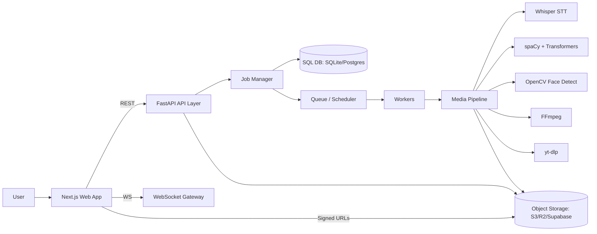
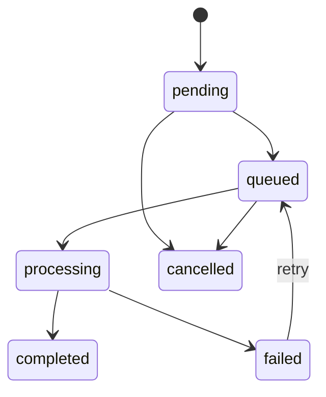
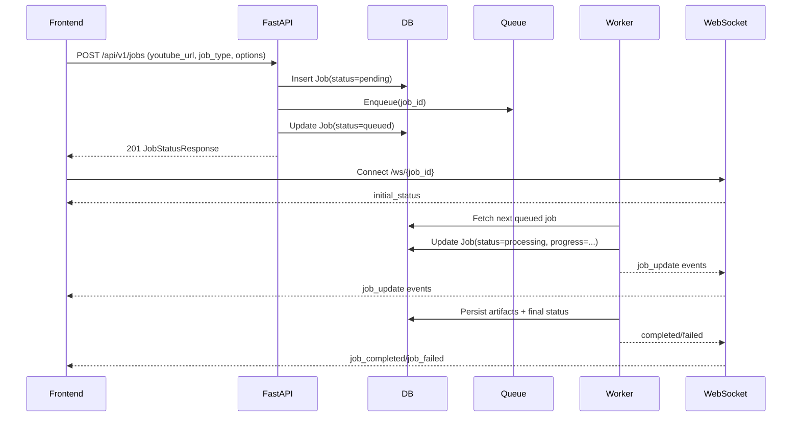

# Shorts Generator — System Architecture & Design

## 1) Scope and goals

This document describes the end-to-end architecture for a **YouTube → Shorts generator**. It is intended to:

- Map product requirements to **backend APIs**, **async processing**, and **frontend features**.
- Define **module boundaries** (API layer, job manager, media pipeline, storage).
- Specify the **async job lifecycle** (submission → queue → processing → progress updates).
- Provide **data contracts** for `/jobs` endpoints and **clip metadata**.
- List key **dependencies**.
- Outline a **deployment strategy** targeting **Vercel/Netlify** for the frontend and serverless API edges while handling heavy binaries/model workloads.
- Provide a recommended **directory layout** and sequencing guidance for future tickets.

Non-goals (for now): multi-tenant auth/billing, collaborative editing, and fully automated “viral” scoring.

---

## 2) Requirements → system mapping

### 2.1 Product requirements (MVP)

| Requirement | Backend responsibility | Processing responsibility | Frontend responsibility |
|---|---|---|---|
| Submit a YouTube URL and create a job | `POST /api/v1/jobs` validates + persists job | N/A | Form to submit URL + options |
| Track job status/progress | `GET /api/v1/jobs/{id}` + list endpoints | Workers update progress/stage | Job detail page, progress bar |
| Real-time updates | WebSocket `/ws/{job_id}` (plus polling fallback) | Workers emit events | WS subscribe + fallback polling |
| Generate candidate clips | Store clip boundaries + metadata | Transcript → segment scoring → clip slicing | Clip list with preview |
| Preview / download outputs | Signed URLs / file serving | Encode outputs (MP4, thumbnails, captions) | Video player + download button |
| Cancel / retry | `POST /jobs/{id}/cancel`, `POST /jobs/{id}/retry` | Worker observes cancellation | Cancel/retry controls |

### 2.2 Feature expansion (post-MVP)

- Face tracking + intelligent cropping to 9:16
- Speaker diarization, highlight detection, hook generation, title/hashtag suggestions
- Template overlays (subtitles styles, progress bar, watermark)
- Multi-clip packaging and publishing integrations

---

## 3) High-level architecture

### 3.1 Component diagram (logical)



### 3.2 Key design choices

- **Async jobs are first-class**: every processing action is a job with status/progress.
- **Processing is idempotent-ish**: stages produce artifacts stored in object storage and referenced from job records.
- **Separation of concerns**:
  - API handles validation, persistence, authorization, orchestration.
  - Workers handle CPU/GPU-heavy processing.
  - Storage layer abstracts local vs cloud storage.

---

## 4) Backend module boundaries

> Names below reflect intended boundaries; the repo may start with a simplified implementation and evolve.

### 4.1 API Layer (FastAPI)

Responsibilities:

- Versioned REST API (`/api/v1/...`)
- WebSocket endpoints (`/ws/{job_id}`)
- Request validation & response shaping
- Authentication (future) and rate limiting

Key modules:

- `app/api/v1/routes/jobs.py`: job creation, listing, lifecycle actions
- `app/api/v1/routes/websocket.py`: real-time updates

### 4.2 Job Manager

Responsibilities:

- Create jobs, validate options, normalize YouTube URLs
- Persist job state + artifacts pointers
- Emit state transitions and events

Internals:

- `Job` table (`jobs`)
- `JobEvent` table (`job_events`) for audit/progress
- Retry policy and cancellation rules

### 4.3 Queue / Scheduler

Responsibilities:

- Accept jobs to be processed
- Prioritize (priority + FIFO)
- Concurrency control

Implementation options:

- MVP: in-process async workers (sufficient for dev)
- Production: Redis queue (RQ/Celery/Arq) or a managed queue (SQS) + dedicated workers

### 4.4 Media Pipeline

Responsibilities:

- Download source media
- Extract audio
- Speech-to-text
- NLP scoring / segment selection
- Video clip cutting and re-encoding
- Optional CV-based reframing

### 4.5 Storage layer

Responsibilities:

- Store:
  - downloaded source
  - extracted audio
  - transcripts
  - clip mp4 outputs
  - thumbnails
  - captions (SRT/VTT)
- Provide signed URLs for frontend consumption

Backends:

- Local filesystem (dev)
- Object storage (prod): S3 / Cloudflare R2 / Supabase Storage

---

## 5) Processing pipeline (stages)

Each job type is a subset of the full pipeline:

1. **Initialize**
   - Validate options
   - Resolve YouTube metadata
2. **Download** (yt-dlp)
   - Download best audio+video or audio-only (depending on workflow)
3. **Extract audio** (FFmpeg)
   - Normalize sample rate (e.g., 16k/48k) and channels
4. **Transcribe** (Whisper base)
   - Produce timestamped segments
5. **Analyze** (spaCy + Transformers)
   - Keyword/topic/sentiment, optionally “highlight scoring”
6. **Generate clip plan**
   - Choose segments (start/end) with constraints (max_clips, clip_duration)
7. **Render clips** (FFmpeg)
   - Cut segments; encode H.264/AAC; generate thumbnails
8. **(Optional) Reframe** (OpenCV face detection)
   - Track faces; generate crop window for 9:16
9. **Finalize**
   - Persist outputs, compute sizes/durations, mark job complete

### 5.1 Artifact outputs per stage

| Stage | Stored artifacts |
|---|---|
| Download | `source.mp4` (or best format) + metadata JSON |
| Extract audio | `audio.wav` |
| Transcribe | `transcript.json` (segments) + `transcript.txt` |
| Analyze | `analysis.json` |
| Clip plan | `clips.json` (selected segments) |
| Render clips | `clips/{clip_id}.mp4`, thumbnails, captions |

---

## 6) Async job lifecycle

### 6.1 State machine



### 6.2 Sequence (submission → processing → updates)



### 6.3 Progress updates: WebSocket + polling fallback

- Primary: **WebSocket** connection to `/ws/{job_id}`
- Fallback: **poll** `GET /api/v1/jobs/{job_id}` every N seconds

Guidance:

- Frontend should *optimistically* open WS after job creation.
- If WS fails (proxy, mobile networks), fallback to polling.

---

## 7) API data contracts

> Contracts below are the target public API for the Shorts generator. The current backend may start with a subset but should converge on these.

### 7.1 `POST /api/v1/jobs`

Request:

```json
{
  "youtube_url": "https://www.youtube.com/watch?v=dQw4w9WgXcQ",
  "job_type": "full_processing",
  "priority": 5,
  "options": {
    "language": "en",
    "whisper_model": "base",
    "clip_duration": 30.0,
    "overlap_duration": 2.0,
    "max_clips": 10,
    "output_format": "mp4",
    "resolution": "1080p"
  }
}
```

Response (`201`): `JobStatusResponse`

```json
{
  "id": "550e8400-e29b-41d4-a716-446655440000",
  "youtube_url": "https://www.youtube.com/watch?v=dQw4w9WgXcQ",
  "job_type": "full_processing",
  "status": "queued",
  "progress": 0.0,
  "priority": 5,
  "created_at": "2025-01-01T12:00:00Z",
  "updated_at": "2025-01-01T12:00:00Z"
}
```

### 7.2 `GET /api/v1/jobs/{job_id}`

Response (`200`): `JobStatusResponse` extended with results when ready

```json
{
  "id": "...",
  "youtube_url": "...",
  "job_type": "full_processing",
  "status": "completed",
  "progress": 100.0,
  "video_title": "Example Video",
  "transcript": "...",
  "transcript_segments": [{"start":0.0,"end":2.1,"text":"..."}],
  "analysis_results": {"topics": ["ai"], "sentiment": "neutral"},
  "generated_clips": [
    {
      "clip_id": "clip_001",
      "title": "Best moment",
      "start_time": 120.4,
      "end_time": 150.4,
      "duration": 30.0,
      "assets": {
        "video_url": "https://storage.example/clips/clip_001.mp4",
        "thumbnail_url": "https://storage.example/clips/clip_001.jpg",
        "captions_vtt_url": "https://storage.example/clips/clip_001.vtt"
      },
      "score": 0.83,
      "tags": ["tutorial", "highlight"]
    }
  ]
}
```

### 7.3 `GET /api/v1/jobs`

Query params (typical):

- `status_filter` (pending/queued/processing/completed/failed/cancelled)
- `job_type`
- `limit`, `offset`

Response: list + pagination metadata.

### 7.4 `POST /api/v1/jobs/{job_id}/cancel`

Request:

```json
{ "reason": "user_cancelled" }
```

Response (`200`):

```json
{ "message": "Job ... has been cancelled", "reason": "user_cancelled" }
```

### 7.5 `POST /api/v1/jobs/{job_id}/retry`

Request:

```json
{ "force": false }
```

Response (`200`): updated `JobStatusResponse` (status reset to queued/pending).

---

## 8) Clip metadata contract

The clip metadata object is the shared contract between backend, storage, and frontend.

### 8.1 `ClipMetadata`

Fields (target):

- `clip_id` (string)
- `title` (string, optional)
- `description` (string, optional)
- `start_time` (float, seconds)
- `end_time` (float, seconds)
- `duration` (float)
- `transcript_segment` (string, optional)
- `score` (float, optional)
- `tags` (string[], optional)
- `assets`:
  - `video_url`
  - `thumbnail_url`
  - `captions_vtt_url` / `captions_srt_url`

Storage guidance:

- Treat `clip_id` as a stable key for filenames and DB references.
- Put all public-facing URLs behind signed URLs (expiring) unless public bucket.

---

## 9) WebSocket contract

WebSocket endpoint: `GET /ws/{job_id}`.

Message envelope:

```json
{
  "type": "job_update",
  "data": {
    "job_id": "...",
    "status": "processing",
    "stage": "transcribing",
    "progress": 70.0,
    "message": "Transcribing audio",
    "timestamp": "2025-01-01T12:00:00Z"
  }
}
```

Recommended `type` values:

- `initial_status`
- `job_update`
- `job_completed`
- `job_failed`

---

## 10) Dependencies

### 10.1 Backend

- **FastAPI** (API + WebSocket)
- **yt-dlp** (YouTube download)
- **FFmpeg** (encode/cut/extract)
- **Whisper (base)** (speech-to-text)
- **spaCy** (linguistic features, entity extraction)
- **Transformers** (classification/summarization/scoring)
- **OpenCV** (face detection / reframing)

### 10.2 Frontend

- **Next.js** (React framework)
- **Tailwind CSS** (UI styling)

---

## 11) Deployment strategy (Vercel/Netlify + heavy binaries)

### 11.1 Reality check: serverless constraints

Vercel/Netlify serverless functions are optimized for short-lived request/response logic. **FFmpeg**, **Whisper**, and large ML dependencies typically exceed:

- execution time limits
- deployment artifact size limits
- cold start budgets
- ephemeral filesystem persistence

### 11.2 Recommended deployment split

1. **Frontend (Vercel/Netlify)**
   - Next.js app deployed normally.
   - Uses environment variables for API base URL and storage/public URLs.

2. **API edge (Vercel/Netlify serverless)**
   - Lightweight endpoints for job submission, status reads, and signed URL minting.
   - Can proxy to a dedicated backend if needed.

3. **Processing workers (container-based runtime)**
   - Run workers on a platform suited for heavy binaries:
     - Fly.io / Render / Railway / ECS / GCP Cloud Run (with CPU time)
   - Container image includes FFmpeg + Python deps + model assets.

4. **Object storage**
   - Store outputs in S3/R2; never rely on serverless local disk for artifacts.

### 11.3 Alternative: “serverless-first” with layers (advanced)

If you must run processing in serverless:

- Use prebuilt FFmpeg layers (Lambda layers) and keep binaries minimal.
- Store Whisper/spaCy models in an external artifact store and download on demand (cached where possible).
- Keep processing within time limits by splitting into **multiple smaller jobs** (download → transcribe → render).

This increases complexity and is usually less reliable than containerized workers.

---

## 12) Directory layout (recommended)

Target monorepo layout:

```text
.
├── backend/
│   ├── app/
│   │   ├── api/
│   │   ├── core/
│   │   ├── db/
│   │   ├── models/
│   │   ├── schemas/
│   │   ├── services/
│   │   │   ├── job_manager/
│   │   │   ├── queue/
│   │   │   ├── media_pipeline/
│   │   │   └── storage/
│   │   └── ...
│   ├── main.py
│   └── requirements.txt
├── frontend/
│   ├── app/                 # Next.js App Router
│   ├── components/
│   ├── lib/                 # API client, WS client
│   ├── styles/
│   └── package.json
├── shared/
│   ├── contracts/           # OpenAPI snippets, JSON schemas
│   └── types/               # Shared TS types generated from OpenAPI
└── docs/
    └── architecture.md
```

---

## 13) Sequencing guidance (future tickets)

A practical implementation order:

1. **Stabilize job API contracts**
   - Ensure `/jobs` endpoints match the schemas
   - Add OpenAPI annotations and examples

2. **Introduce storage abstraction**
   - LocalStorage (dev)
   - S3/R2 storage (prod)

3. **Implement pipeline stage runners**
   - Download + audio extraction (yt-dlp + FFmpeg)
   - Whisper transcription
   - Clip plan generation
   - FFmpeg clip rendering

4. **Add real-time progress events**
   - Consistent event types + stage mapping
   - WS + polling fallback in the frontend

5. **Add frontend MVP**
   - Submit job
   - Job list + job detail
   - Clip preview + download

6. **Hardening**
   - Retries, timeouts, idempotency keys
   - Observability (structured logs + metrics)

7. **CV features (optional)**
   - Face detection + dynamic crop window

---

## 14) Appendix: status/stage vocabulary

- `status`: pending, queued, processing, completed, failed, cancelled
- `stage`: initializing, downloading, extracting_audio, transcribing, analyzing, generating_clips, finalizing
